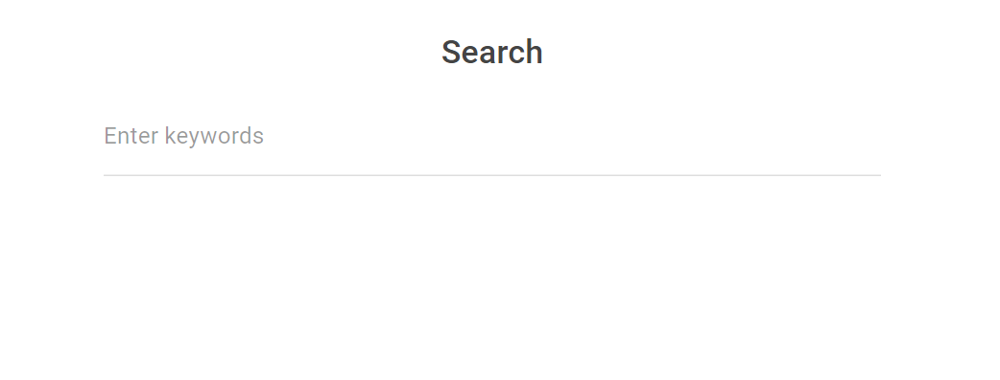

# Search-Box
A simple ITR(Information Retrievel System) using DRF(Django Rest Framework) and JS

## Steps to run the code 
### 1
Clone the repo using the command 
`git clone https://github.com/Himanshu372/Search-Box.git` 
on your local system 

### 2 
 Due to shortage of time, I haven't able to dockerize the repo, 
but I have include the required Dockerfile and docker-compose.yml.  
With further commits the application can be dockerized. 
### Current way to execute code
Create a folder for setting up virtual environment at the manage.py level 
`mkdir venv` 
Setup virtual environment inside venv/ folder 
`python3 -m venv /path/to/venv repo` 
For this step python3 has to pre-installed on your system 
This will create a venv/ virutal environment folder at the repo base 

For activating the virtual env, navigate to Scripts/bin(depending on OS) folder of the venv directory and use the command 
`source {Scripts/bin}/activate` 
You'll able to see `(venv)` in your shell, which is an indicator that virtual environment is active 

### 3 
Downloading required packages from requirements.txt 
`pip install -r requirements.txt` 
This is download all the required packages to virtual env 

### 4 
Executing code 
Go the level where you can manage.py file is in the repo(which is the base level) and execute this command  
`python manage.py runserver` 
This is will start the application in development envrionment 
### Open index.html from frontend folder in repo on any browser and you should be able to see this UI 
---

---

### 5
Executing custom management command  
Keep the text data file at the level of manage.py and execute the command 
`python manage.py populate_db --filename` 
From the file database will get populated 

### 6
Executing tests 
For executing tests, use the following command at the 'tests' directory level inside the app 
`./manage.py test bike_app.tests.{test_filename}` 
